# dotfiles

- [Mac用セットアップ](./docs/mac.md)
- [Linux用セットアップ](./docs/linux.md)
- [Windows用セットアップ](./docs/windows.md)

## 構成

```bash

~/dotfiles
├── README.md
├── docs/                   # それぞれのOS別のドキュメント
│   ├── mac.md
│   ├── linux.md
│   └── windows.md
├── bin/                    # どのマシンでも使いたい自作スクリプト
│   └── backup-xxx.sh
├── shell/
│   ├── common.sh           # すべてのシェル共通 (PATH, alias, env)
│   ├── zsh/
│   │   ├── main.zsh        # Zsh共通設定
│   │   ├── prompt.zsh
│   │   └── completion.zsh
│   ├── bash/
│   │   └── main.bash       # Bash用設定
│   └── powershell/
│       └── profile.ps1     # Windows用 (あれば)
├── host/
│   ├── macbook-pro.local.zsh    # ホスト固有の設定
│   ├── datacomp-ubuntu.zsh
│   └── wsl-ubuntu.zsh
├── os/
│   ├── mac.zsh             # macOS向け (brew 関連とか)
│   ├── linux.zsh           # Linux向け
│   └── windows.ps1         # Windows向け
├── bootstrap/
│   ├── install.sh          # 初期設定スクリプト (symlink貼るなど)
│   └── detect_os.sh        # OS検出など
└── config/
    ├── gitconfig           # 共通の git 設定
    └── starship.toml       # プロンプトツール等の設定

```

## フローチャート

```mermaid
flowchart TD

    %% スタート
    A[Macの新規環境] --> B[1. Xcode CLI / Gitのインストール<br/>xcode-select --install または brew install git]

    %% dotfiles の取得
    B --> C[2. dotfilesリポジトリをclone<br/>git clone git@github.com:you/dotfiles.git ~/dotfiles]

    %% bootstrap 実行
    C --> D[3. bootstrap/install.sh を実行<br/>cd ~/dotfiles && ./bootstrap/install.sh]

    %% install.sh の中の処理
    subgraph INSTALL[install.sh の主な処理]
      D --> D1[既存の ~/.zshrc / ~/.bashrc / ~/.gitconfig をバックアップ<br/>（あればリネーム保存）]
      D1 --> D2[stub.zshrc / stub.bashrc をホームに symlink<br/>~/.zshrc -> dotfiles/bootstrap/stub.zshrc]
      D2 --> D3[共通設定ファイル・ツールを symlink<br/>~/.gitconfig -> dotfiles/config/gitconfig など]
      D3 --> D4[~/bin の作成 & dotfiles/bin を追加リンク]
    end

    D4 --> E[4. シェルを再起動 or exec zsh]

    %% ".zshrc (stub) の読み込みフロー"
    subgraph ZSHRC["~/.zshrc (stub) がやること"]
      E --> F[DOTFILES=$HOME/dotfiles を設定]
      F --> G[共通設定の読み込み<br/>shell/common.sh]
      G --> H[Zsh共通設定の読み込み<br/>shell/zsh/main.zsh]
      H --> I[OS判定<br/>uname -s で Darwin を検出]
      I --> J[macOS用設定を読み込み<br/>os/mac.zsh]
      J --> K[ホスト名を取得<br/>hostname]
      K --> L[対応するホスト別設定を読み込み<br/>host/<hostname>.zsh があれば]
      L --> M["ローカル専用設定を読み込み<br/>~/.zshrc.local (Git管理外) があれば"]
    end

    M --> N[5. 新しいシェル環境が有効化<br/>共通alias・PATH・brew設定など反映済み]

    %% その後の運用
    N --> O[6. 設定を変えたいときは<br/>~/dotfiles 内の各ファイルを編集]
    O --> P[7. Gitで commit & push<br/>→ 他のMac/VMでも clone + install で同じ環境]

```

