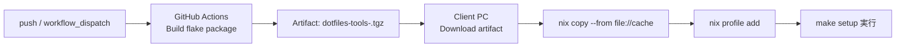

これまでの修正内容（コマンドのアップデート、パスやロックファイルの回避策、Nix自体の導入方法など）をすべて統合し、1つの完全な `README.md` として再生成しました。

そのままコピー＆ペーストしてご利用いただけます。

---

```markdown
# dotfiles

## 構成

```bash
~/dotfiles
├── README.md
├── back-up/
│   └── 既存の設定ファイルの退避先
├── bootstrap/
│   ├── setup.pm
│   └── mac_zsh.pm (legacy)
├── docs
│   └── mac.md
├── nix
│   └── flake.nix
├── makefile
├── .gitignore
└── config/
    ├── .zprofile            # 共通 fallback
    ├── .zshrc               # 共通 fallback
    ├── mac/
    │   └── .bashrc          # macOS 専用
    └── linux/
        └── .bashrc          # Linux 専用
```

## 事前準備（Nixを利用する場合）

ホスト環境に `make` や `perl` がない場合でも、Nix を使ってセットアップが可能です。Nix本体が未インストールの場合は、以下の推奨コマンド（Determinate Systems版）で導入してください。

```bash
curl --proto '=https' --tlsv1.2 -sSf -L [https://install.determinate.systems/nix](https://install.determinate.systems/nix) | sh -s -- install
```

> **Note:** インストール直後に `nix` コマンドが見つからない場合は、ターミナルを再起動するか、以下を実行してパスを読み込んでください。
> ` . /nix/var/nix/profiles/default/etc/profile.d/nix-daemon.sh `

---

## セットアップ方法

### 1) Nix が提供する実行環境で実行する（`make` 未導入でも可）

`make` がホスト環境に未導入でも、Nix の開発シェル経由で `nix/flake.nix` に定義されたツール（`gnumake`, `perl`）を利用して実行できます。

**ローカルにクローンして実行する場合:**
```bash
git clone [https://github.com/ShotaArima/dotfiles.git](https://github.com/ShotaArima/dotfiles.git) ~/dotfiles
cd ~/dotfiles
# Flakesが有効な環境で実行
nix develop ./nix -c make setup
```

**GitHubから直接ツールをインストールする場合:**
※ Nixの「実験的機能（Flakes/nix-command）」が有効である必要があります。

```bash
# 実験的機能が未設定の場合は、~/.config/nix/nix.conf 等に以下を追記してください。
# experimental-features = nix-command flakes

# リモートからツールのインストール
# (ディレクトリ指定 `?dir=nix` とロックファイル生成スキップ `--no-write-lock-file` が必要です)
nix profile add "github:ShotaArima/dotfiles?dir=nix#dotfiles-tools" --no-write-lock-file

make --version
make setup
```

### 2) 開発シェルへ入ってから手動で実行する場合

```bash
cd ~/dotfiles
nix develop ./nix
make setup
```

### 3) 従来どおり、ホスト側に `make` がある場合

ホスト環境にすでに `make` と `perl` がインストールされている場合は、Nixを経由せずに直接実行することも可能です。

```bash
git clone [https://github.com/ShotaArima/dotfiles.git](https://github.com/ShotaArima/dotfiles.git) ~/dotfiles
cd ~/dotfiles
make setup
```

---

## 応用: GitHub ActionsでビルドしたNix環境をクライアントへ反映する構成

`dotfiles-tools`（`make` + `perl` を含む）を GitHub Actions でビルドし、成果物（Nix closure）をクライアントPCへ取り込んでインストールすることも可能です。



対応workflow: `.github/workflows/build-nix-tools.yml`

クライアントPC側の適用手順（artifact展開後）:

```bash
tar -xzf dotfiles-tools-x86_64-linux.tgz
nix copy --from "file://$PWD/cache" "$(cat store-path.txt)"
nix profile add "$(cat store-path.txt)"
make --version
```

---

## テスト（GitHub Actions）

`push` と `pull_request` のタイミングで、以下を自動実行します。

- `nix` コマンドの実行確認（`nix --version` / `nix profile --help`）
- `bootstrap/mac_zsh.pm` の構文チェック（`perl -c`）
- 一時 `HOME` を使ったセットアップの統合テスト（バックアップ作成とシンボリックリンク作成の確認）

## OS別の設定ファイル解決ルール

`make setup` は実行中OSを自動判定して、以下の優先順でシンボリックリンク元を決定します。

1. `config/<os>/<ファイル名>`
2. `config/<ファイル名>`（共通 fallback）

**例:**
- macOS で `.bashrc` を張る場合: `config/mac/.bashrc` を優先
- Linux で `.bashrc` を張る場合: `config/linux/.bashrc` を優先
- OS専用ファイルが無い場合: `config/.zshrc` など共通ファイルを利用

**対象ファイル:**
- `.zshrc`
- `.zprofile`
- `.bashrc`
- `.bash_profile`
- `.profile`

既存ファイルがシンボリックリンク以外の場合、`back-up/<timestamp>/` へ退避してからリンクを作成します。
```
