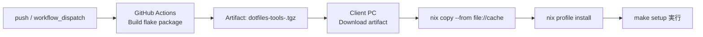

# dotfiles

## 構成

```bash
~/dotfiles
├── README.md
├── back-up/
│   └── 既存の設定ファイルの退避先
├── bootstrap/
│   ├── setup.pm
│   └── mac_zsh.pm (legacy)
├── docs
│   └── mac.md
├── nix
│   └── flake.nix
├── makefile
├── .gitignore
└── config/
    ├── .zprofile            # 共通 fallback
    ├── .zshrc               # 共通 fallback
    ├── mac/
    │   └── .bashrc          # macOS 専用
    └── linux/
        └── .bashrc          # Linux 専用
```

## セットアップ方法

### GitHub ActionsでビルドしたNix環境をクライアントへ反映する構成

可能です。`dotfiles-tools`（`make` + `perl` を含む）を GitHub Actions でビルドし、成果物（Nix closure）をクライアントPCへ取り込んで `nix profile install` できます。



対応workflow: `.github/workflows/build-nix-tools.yml`

クライアントPC側の適用手順（artifact展開後）:

```bash
tar -xzf dotfiles-tools-x86_64-linux.tgz
nix copy --from "file://$PWD/cache" "$(cat store-path.txt)"
nix profile install "$(cat store-path.txt)"
make --version
```

### 1) まず Nix が提供する実行環境で実行する（`make` 未導入でも可）

`make` がホスト環境に未導入でも、先に Nix の開発シェル経由で実行できます。

```bash
git clone https://github.com/ShotaArima/dotfiles.git ~/dotfiles
cd ~/dotfiles
nix develop ./nix -c make setup
```

上記は `nix/flake.nix` で定義した `gnumake` / `perl` を使って `make setup` を実行します。

また、GitHub上のflake出力を直接使う場合は以下でも導入できます。

```bash
nix profile install github:ShotaArima/dotfiles#dotfiles-tools
make --version
```

### 2) 開発シェルへ入ってから実行する場合

```bash
cd ~/dotfiles
nix develop ./nix
make setup
```

---

従来どおり、ホスト側に `make` がある場合は以下でも実行できます。

```bash
git clone https://github.com/ShotaArima/dotfiles.git ~/dotfiles
cd ~/dotfiles
make setup
```
## テスト（GitHub Actions）

`push` と `pull_request` のタイミングで、以下を自動実行します。

- `nix` コマンドの実行確認（`nix --version` / `nix profile --help`）
- `bootstrap/mac_zsh.pm` の構文チェック（`perl -c`）
- 一時 `HOME` を使ったセットアップの統合テスト（バックアップ作成とシンボリックリンク作成の確認）

## OS別の設定ファイル解決ルール

`make setup` は実行中OSを自動判定して、以下の優先順でシンボリックリンク元を決定します。

1. `config/<os>/<ファイル名>`
2. `config/<ファイル名>`（共通 fallback）

例:

- macOS で `.bashrc` を張る場合: `config/mac/.bashrc` を優先
- Linux で `.bashrc` を張る場合: `config/linux/.bashrc` を優先
- OS専用ファイルが無い場合: `config/.zshrc` など共通ファイルを利用

対象ファイル:

- `.zshrc`
- `.zprofile`
- `.bashrc`
- `.bash_profile`
- `.profile`

既存ファイルがシンボリックリンク以外の場合、`back-up/<timestamp>/` へ退避してからリンクを作成します。
