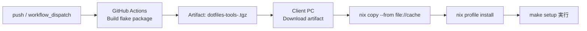

# dotfiles

## 構成

```bash
~/dotfiles
├── README.md
├── back-up/
│   └── 既存の設定ファイルの退避先
├── bootstrap/
│   ├── setup.pm
│   └── mac_zsh.pm (legacy)
├── docs
│   └── mac.md
├── nix
│   └── flake.nix
├── makefile
├── .gitignore
└── config/
    ├── .zprofile            # 共通 fallback
    ├── .zshrc               # 共通 fallback
    ├── mac/
    │   └── .bashrc          # macOS 専用
    └── linux/
        └── .bashrc          # Linux 専用
```

## セットアップシナリオ

README を「初回構築」と「更新」に分けて使えるように整理しました。

### シナリオ1: 全く Nix も何もない環境から構築する

最短は **Nix を先に入れて、Nix が提供する `make` / `perl` で `make setup` を実行**する方法です。

1. Nix をインストールする（公式インストーラー）
2. このリポジトリを clone する
3. `nix develop` 経由で `make setup` を実行する

```bash
git clone https://github.com/ShotaArima/dotfiles.git ~/dotfiles
cd ~/dotfiles
nix develop ./nix -c make setup
```

> ホスト側に `make` が未導入でも動作します。

#### 補足: GitHub Actions でビルドした成果物を使う場合

`dotfiles-tools`（`make` + `perl` を含む）を GitHub Actions でビルドした成果物（Nix closure）から導入できます。

対応 workflow: `.github/workflows/build-nix-tools.yml`



クライアント PC 側の適用手順（artifact 展開後）:

```bash
tar -xzf dotfiles-tools-x86_64-linux.tgz
nix copy --from "file://$PWD/cache" "$(cat store-path.txt)"
nix profile install "$(cat store-path.txt)"
make --version
```

または GitHub 上の flake 出力を直接使うこともできます。

```bash
nix profile install github:ShotaArima/dotfiles#dotfiles-tools
make --version
```

### シナリオ2: 以前 dotfiles で構築済みで、更新する

既存環境を壊さずに更新する想定です。

1. 既存の `~/dotfiles` に移動
2. リポジトリを更新（`git pull`）
3. 再度 `make setup` を実行

```bash
cd ~/dotfiles
git pull
nix develop ./nix -c make setup
```

Nix を使わず、ホスト側に `make` がある場合は以下でも更新できます。

```bash
cd ~/dotfiles
git pull
make setup
```

> `make setup` 実行時、既存ファイルがシンボリックリンク以外なら `back-up/<timestamp>/` へ退避してからリンクを再作成します。

## テスト（GitHub Actions）

`push` と `pull_request` のタイミングで、以下を自動実行します。

- `nix` コマンドの実行確認（`nix --version` / `nix profile --help`）
- `bootstrap/mac_zsh.pm` の構文チェック（`perl -c`）
- 一時 `HOME` を使ったセットアップの統合テスト（バックアップ作成とシンボリックリンク作成の確認）

## OS別の設定ファイル解決ルール

`make setup` は実行中OSを自動判定して、以下の優先順でシンボリックリンク元を決定します。

1. `config/<os>/<ファイル名>`
2. `config/<ファイル名>`（共通 fallback）

例:

- macOS で `.bashrc` を張る場合: `config/mac/.bashrc` を優先
- Linux で `.bashrc` を張る場合: `config/linux/.bashrc` を優先
- OS専用ファイルが無い場合: `config/.zshrc` など共通ファイルを利用

対象ファイル:

- `.zshrc`
- `.zprofile`
- `.bashrc`
- `.bash_profile`
- `.profile`

既存ファイルがシンボリックリンク以外の場合、`back-up/<timestamp>/` へ退避してからリンクを作成します。
